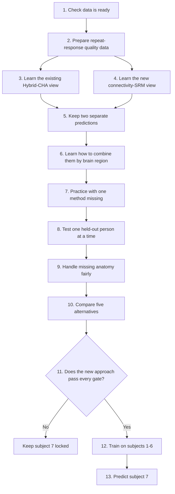

# How the multi-expert pipeline works

This guide explains the experimental Stage-1 pipeline in everyday language.
It is separate from the frozen production pipeline.

## Pipeline schematic

## The stages

- **1. Check that everything is ready**

  Before learning begins, the pipeline checks that the brain scans, image
  information, resting-state files, and brain-area maps are all present and
  agree with each other. This avoids spending a long time on a run whose input
  files do not fit together.

- **2. Prepare reliability data**

  Some images were shown more than once. The pipeline keeps these separate
  responses so it can later identify which brain locations produce stable,
  repeatable signals and which are mainly noisy. It adds these quality-check
  files without changing the existing task-training data.

- **3. Learn the existing Hybrid-CHA view**

  This is the current approach. It uses the way brain areas move together while
  a person is resting as a personal translation guide, then places people into
  a shared language that can be compared across individuals.

- **4. Learn the new connectivity-SRM view**

  This second approach also starts from resting brain activity, but first looks
  for a common pattern across the group. It then learns how each individual
  person relates to that common pattern.

- **5. Keep both views independent**

  The two approaches are allowed to make their own predictions first. This is
  important because one may be more useful for a particular person or brain
  area than the other.

- **6. Learn how to combine them**

  A combined model learns when to trust the existing method, the new method,
  or a mixture of both. It can make a different choice in different brain
  regions instead of using one fixed percentage for the whole brain.

- **7. Practice with one method missing**

  During training, the combined model sometimes has to work without one of the
  two views. This helps it remain useful when one method is less informative,
  rather than becoming completely dependent on its favourite method.

- **8. Test one person at a time**

  The system repeatedly leaves out one of subjects 1-6, learns from the other
  five, and predicts the held-out person. This is the most honest available
  test of whether the method can handle a person whose task data were not used
  to build the shared setup.

- **9. Handle individual anatomy fairly**

  A small brain label can exist in the five training people but be absent in
  the held-out person. The pipeline records that absence and treats that piece
  as unavailable; it does not change the shared setup using the held-out
  person’s task responses.

- **10. Compare five clear alternatives**

  Every held-out person is evaluated with the existing method alone, the new
  method alone, a simple equal mixture, a learned mixture without the training
  safeguard, and the final learned mixture with the safeguard. This shows
  whether an improvement comes from the new method itself or from the way the
  two methods are combined.

- **11. Judge the result carefully**

  The final decision is not based on one lucky score. The approach must improve
  overall, help most people, work across several random starts, and avoid a
  drop in the brain locations whose measured responses are most dependable.

- **12. Decide whether subject 7 may be used**

  Subject 7 is intentionally kept separate. The pipeline unlocks prediction
  for subject 7 only if the combined method passes every check on subjects 1-6;
  otherwise subject 7 remains protected from being used as a misleading success
  example.

- **13. Keep a record of what happened**

  Each run records the input data, settings, brain maps, and model files that
  were used. If one of these changes later, old results are rejected rather
  than quietly reused, keeping the comparison trustworthy.

## What happens after a pass

Only after the gate passes is the final combined model trained on all six
available training subjects. It can then make a prediction for subject 7 with
no task examples, or with the planned small set of 100 task examples.

The future ROI-based CHA and VAE approaches are not included here. They remain
later candidates, to be considered only if this first two-method version earns
promotion through the gate.
