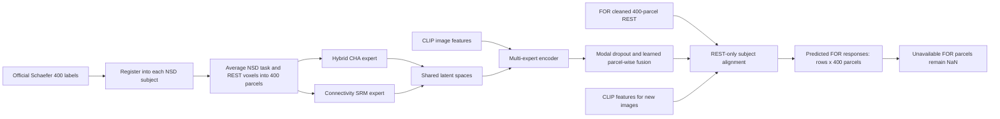

# Schaefer-400 training and FOR transfer

This is a separate training track. It does not alter the existing voxel-based
`config_multiexpert.yaml` pipeline.

## What is made comparable

Both datasets are represented as the same ordered list of 400 cortical parcels:

- Atlas: `Schaefer2018_400Parcels_7Networks_order`
- Canonical parcel IDs: `1 ... 400`
- Left hemisphere: parcels `1 ... 200`
- Right hemisphere: parcels `201 ... 400`
- Fusion resolution: one learned expert mixture per parcel

The underlying image grids do not need to be identical after this conversion.
NSD is sampled in each subject's native 1.8 mm functional grid before its voxels
are averaged into parcels. The existing FOR export was sampled in its own BOLD
grid (about 3.28 x 3.28 x 4.18 mm) and already provides the 400 parcel time
series. The model sees ordered parcel signals, not either dataset's raw voxels.

FOR contains 237 time points at TR 2.0 seconds. NSD REST uses TR about 1.333
seconds and has varying usable run lengths after cleanup. This is acceptable for
the current alignment experts because they compare parcel-to-parcel correlation
patterns rather than matching time point 1 to time point 1.

## Pipeline schematic



## Exact stages

1. Validate the real FOR export.

   ```bash
   ./run_schaefer400.sh check-for
   ```

   This validates every `sub-*` folder, the MATLAB-v7.3 time series, canonical
   parcel order, TSV availability flags, TR, and missing parcels. It does not
   calculate prediction accuracy.

2. Validate the existing NSD source files.

   ```bash
   ./run_schaefer400.sh check-raw
   ```

   This checks the experiment design, task beta sessions, REST runs, and native
   functional reference for NSD subjects 1-6.

3. Create subject-native Schaefer atlases.

   ```bash
   ./run_schaefer400.sh prepare-atlas
   ```

   The command downloads only the required official CBIG annotations and NSD
   transforms. It maps the fsaverage parcel labels to each NSD subject, samples
   three cortical depths, performs winner-take-all mapping in the native 1.8 mm
   functional grid, and requires every parcel to contain enough voxels.

4. Prepare parcel-level NSD data.

   ```bash
   ./run_schaefer400.sh prepare-nsd
   ```

   For task data, each raw beta trial is averaged within parcels and repeated
   presentations of an image are then averaged. For REST, each raw run is first
   reduced to 400 parcel signals, followed by the configured motion cleanup,
   filtering, and final parcel standardization. Processing is chunked so a full
   4D beta file is not held in memory at once.

5. Check that training inputs are complete.

   ```bash
   ./run_schaefer400.sh check-train
   ```

   This requires complete 400-parcel task and REST arrays for all six subjects,
   plus the existing CLIP feature matrix.

6. Train the model.

   ```bash
   ./run_schaefer400.sh train
   ```

   The two alignment methods learn their shared spaces from parcel-level NSD
   data. The image encoder learns both outputs and a separate mixture of the two
   methods for every parcel. Modal dropout sometimes hides one method during
   training so neither method becomes an irreplaceable shortcut.

7. Align and predict for one FOR subject.

   ```bash
   FOR_SUBJECT=sub-0027 FEATURES=/absolute/path/to/clip_features.npy ./run_schaefer400.sh predict-for
   ```

   `FEATURES` must be an `N x F` NumPy array with the same CLIP width used for
   training. FOR REST determines the subject alignment. The feature rows
   determine which new image responses are predicted.

## Missing FOR parcels

The current FOR export has 50 subjects. All have 237 time points at TR 2.0
seconds. Available parcels range from 394 to 400; 37 subjects have at least one
fully missing parcel.

Missing parcels are handled in two different roles:

- As connectivity seeds, their fixed positions are retained and filled with
  zeros. This preserves the exact 1-to-400 seed order used during training.
- As prediction targets, they are removed before alignment. The model therefore
  does not invent a transform for absent data.
- Saved predictions are expanded back to 400 columns, with `NaN` at unavailable
  parcels and an accompanying `available_parcels.npy` mask.

## Outputs and provenance

The trained model defaults to:

```text
artifacts/schaefer400_multiexpert/model/
```

It includes both experts, the fusion encoder, the exact atlas/seed contract,
training split, input summaries, checksums, and the effective configuration.

FOR predictions default to:

```text
artifacts/schaefer400_multiexpert/for_predictions/sub-XXXX/
```

The folder contains learned-fusion, equal-fusion, and individual-expert
predictions; parcel availability; learned regional weights; subject transforms;
and `provenance.json`. The provenance explicitly records
`"accuracy_computed": false` because the supplied FOR tree has no matching task
fMRI target.

## Current verification status

Verified automatically:

- all 50 real FOR subject exports load under the strict contract;
- subject 1 registration produces all 400 parcels in an 81 x 104 x 83, 1.8 mm
  native NSD grid (164,079 labeled voxels; minimum parcel size 113 voxels);
- a real subject 1 REST NIfTI reduces to `226 x 400`, cleans to `221 x 400`, and
  finishes finite with parcel means near zero and standard deviations near one;
- the synthetic end-to-end test trains both experts, saves and reloads the model,
  aligns a FOR-like subject with a missing parcel, and preserves that parcel as
  `NaN` in prediction;
- the complete repository test suite passes.

Still intentionally not run as part of implementation:

- full preparation of every NSD beta session;
- full GPU training on subjects 1-6;
- scientific validation of transfer quality on FOR, because no FOR task target
  was requested or supplied.
